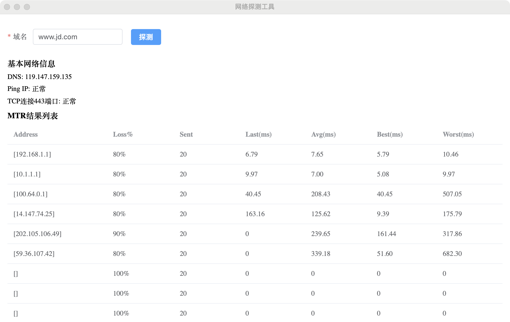

# 网络探测客户端工具
作用是快速排查网络问题，其中提供了多个检查内容，包括：

|检查内容|说明|
|----|----|
|DNS|尝试解析DNS域名，获取对应的IP，并使用获取到的IP来进行后续流程|
|Ping|使用Ping去尝试跟对应IP的网络连通性|
|MTR|traceroute，查看网络的转发，还有网络质量|
|TCP 连接|尝试进行TCP连接，有时候防火墙就对此进行拦截|



## 应用场景&优势
- 业务站点打不开/特别慢时，使用工具快速定位是否是网络问题/具体是网络的哪一段有问题
- 实时网络监控诉求，该工具会在点击“探测”后，每隔30s自动做探测，并在代码中提供了上报的钩子，可将探测结果数据上报到你的服务端，做数据分析处理&大盘&告警处理
- IP被封、TCP443端口被封
- DNS解析异常

## 为什么将ping、tcp、mtr集成到一起
这是因为：
- ping使用的是ICMP协议，而TCP使用的是TCP协议，ping得通不代表业务接口链路通
- ping测试通常是MTR测试中的一部分，ping得通，不一定代表mtr能通
- 检测网络链路是否通仅仅是基础，我们期望能定位到具体是网络哪一段有问题

### 优势
- windows在程序关闭后后台运行
- windows系统重启自动后台运行，对用户无感知
- 相比Electron打包体积动则上百M，该工具打包体积只有10M左右

## 下载地址
[Download page](https://github.com/binshao996/network-detector/releases/tag/v1.0.0)

## 本地编译
可以基于本程序做二次开发，按照如下方式进行编译.

|操作系统|开发构建方式|用户执行方式|
|----|----|----|
|Windows|项目下执行make build-windows|安装并直接点击运行|
|MacOS|项目下执行make build-mac|shell中执行chmod u+x network-detector && sudo ./network-detector|
|Linux|项目下执行make build-linux|shell中执行chmod u+x network-detector && sudo ./network-detector|

## 实现
基于[wails](https://wails.io/)框架（Go+Vue3）实现。    
探测部分基于以下几个模块实现：
- DNS：Go的net包
- Ping：Go的net包、golang.org/x/net/icmp、golang.org/x/net/ipv4
- TCP：Go的net包
- MTR：github.com/tonobo/mtr/pkg/hop、github.com/tonobo/mtr/pkg/mtr、golang.org/x/net/icmp

对于平台差异化，使用如下编译指令做兼容处理：  

### windows
```
//go:build windows
// +build windows
```

### 非windows
```
//go:build !windows
// +build !windows
```

### 开机启动程序
具体实现是将工具可执行路径写入到系统注册表中
```
// 获取应用的可执行文件路径
exePath, err := os.Executable()
if err != nil {
    logger.Error("Failed to get executable path:", err)
    return false, err
}

// 注册表路径
regPath := `SOFTWARE\Microsoft\Windows\CurrentVersion\Run`

// 打开注册表项
key, _, err := registry.CreateKey(registry.CURRENT_USER, regPath, registry.SET_VALUE)
if err != nil {
    logger.Error("Failed to open registry key:", err)
    return false, err
}
defer key.Close()

// 设置注册表项的值，注意这里的路径
appName := "network-detector" // 修改为你的应用名称
logger.Printf("exePath is exePath:%s", exePath)
if err := key.SetStringValue(appName, exePath); err != nil {
    logger.Error("Failed to set registry value:", err)
    return false, err
}
```

